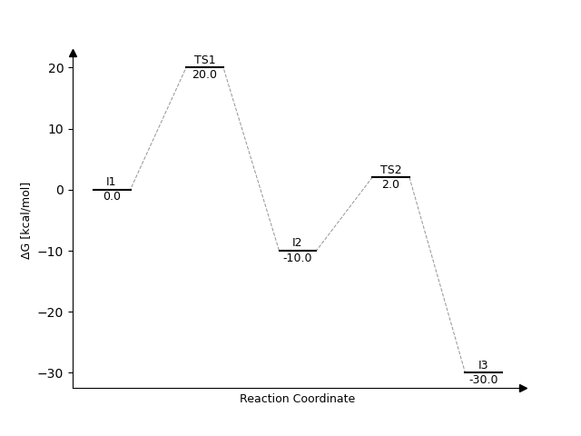
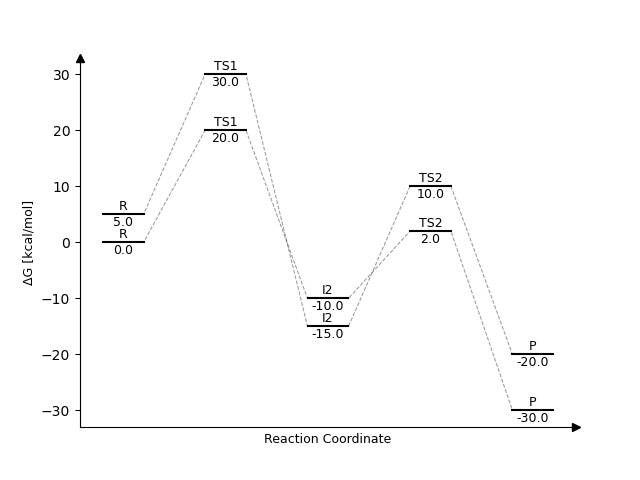

# Pathways

Simple Python program that plots a reaction coordinate diagram, given a dictionary of points.

Requires NumPy and Matplotlib.

## Usage

Edit the dictionary named pes as required and run the pathways.py script.

## Example Output

Single pathway:

Two pathways:

## TODO

- Add ability to plot multiple pathways on one plot.
- Add small images of structures.